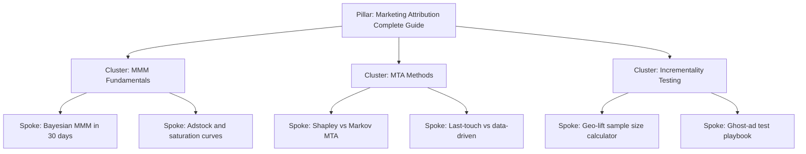

# Semantic SEO Skill

Owned by `seo-analyst`. Powers organic-search growth as a durable, non-paid acquisition channel. Modern SEO is **semantic** — search engines reward topical authority and entity coverage, not keyword stuffing.

## 1. Topic Cluster Model (Pillar + Cluster + Spoke)

Rules:
- One pillar per topic per site (avoid keyword cannibalization)
- Pillar is 2,500-5,000 words, comprehensive, periodically refreshed
- Cluster pages link UP to pillar; spokes link UP to cluster and SIDEWAYS to siblings
- Pillar links DOWN to every cluster; never to every spoke (curate)

## 2. SERP Analysis Checklist

For each target keyword, before writing:

- [ ] **Intent classification**: navigational / informational / commercial / transactional
- [ ] **SERP features present**: featured snippet, People-Also-Ask, knowledge panel, image pack, video carousel, shopping, local pack, AI Overview
- [ ] **Top 10 organic content type**: listicle / how-to / definition / comparison / tool / case study / product page
- [ ] **Top 10 word count distribution**: median and IQR
- [ ] **Domains ranking**: are they DR-equal, weaker (opportunity), or stronger (barrier)
- [ ] **Last-updated freshness**: avg age of top-10 results
- [ ] **AI Overview present**: if yes, what is cited; can we earn citation?
- [ ] **Brand vs publisher mix**: helps decide content angle

## 3. Entity SEO Concepts

Search engines understand **entities** (people, places, organizations, products, concepts) and their relationships (knowledge graph), not just strings.

### Practical Application

- **Schema.org markup** on every templated page:
  - `Organization` on homepage and about
  - `Product` or `Service` on offering pages
  - `Article` with `author` (linked to `Person` entity) on content
  - `FAQPage` on pages with explicit Q&A
  - `BreadcrumbList` on category/cluster pages
  - `LocalBusiness` for service-area businesses
- **Entity establishment** for the brand:
  - Wikidata entry (where notable)
  - Consistent NAP (Name/Address/Phone) across the web
  - Knowledge Panel claim (Google Business / Search Console)
  - Author profiles with traceable cross-links
- **Co-occurrence**: mention semantically related entities in content (e.g. an MMM article should reference adstock, saturation, Bayesian inference, MCMC, geo-lift)

## 4. Content-Gap Mapping Process

Step-by-step:

1. **Inventory current content**: crawl the site, classify by topic
2. **Pull competitor content**: identify 3-5 organic competitors (Ahrefs / Semrush / SimilarWeb)
3. **Keyword overlap analysis**: keywords competitors rank top-20 for that we don't
4. **Filter by relevance**: drop keywords outside our taxonomy
5. **Cluster by topic**: group keywords into themes
6. **Score each cluster**: search volume * intent * business value * winnability
7. **Prioritize**: top 5-10 clusters become content roadmap
8. **Assign**: pillar, cluster, or spoke status

### Tools
- Ahrefs (content gap, Top Pages, Keywords Explorer)
- Semrush (keyword gap, Topic Research)
- SimilarWeb (traffic, top pages of competitors)
- Google Search Console (existing performance, query-page mismatch)
- Google Trends (seasonality, regional intent)

## 5. Keyword Research Framework

Score each candidate keyword across four dimensions:

| Dimension | Source | Score 1-5 |
|---|---|---|
| Search volume | Keyword tool | 1 = <100/mo, 5 = >10k/mo |
| Keyword difficulty (KD) | Ahrefs/Semrush DR | Inverted: 1 = KD>70, 5 = KD<20 |
| Intent fit | Manual SERP review | 1 = mismatch, 5 = perfect fit |
| Business value | Internal | 1 = brand awareness only, 5 = bottom-of-funnel |

Composite = mean of four. Prioritize composite >= 3.5.

### Keyword Type Mix Target

| Type | Examples | % of content effort |
|---|---|---|
| Pillar (head, informational) | "marketing attribution" | 10% |
| Cluster (mid-tail, informational/commercial) | "what is MMM" | 30% |
| Spoke (long-tail, mixed) | "how to run a geo-lift test" | 40% |
| Bottom-funnel (transactional) | "MMM consulting" | 15% |
| Branded | "[brand] case study" | 5% |

## 6. Internal Linking Strategy

| Principle | Implementation |
|---|---|
| Topic hubs | Every cluster has a hub page linking to all its spokes |
| Anchor diversity | Use varied descriptive anchors, not just exact-match keyword |
| Reciprocal cluster links | Sibling spokes link to each other when topically related |
| Pillar from sitewide | Pillar in main nav or footer (every page link-equity) |
| New content gets links | When publishing a new spoke, add 2-3 links from existing high-traffic pages |
| Audit orphans | Quarterly: no page should be >3 clicks from home |

### Anchor Text Distribution Target
- 40% exact / partial match
- 30% branded / URL
- 20% generic ("learn more", "see this")
- 10% long-tail descriptive

## 7. Industry-Aware Adjustments

| Profile | SEO emphasis |
|---|---|
| B2B SaaS | Pillar+cluster on category, competitor comparison pages, integration pages |
| DTC E-com | Category + collection pages, product schema, review markup, gift guides |
| Pro Services | Service pages, case studies, local + service-area SEO |
| Regulated | Compliance-reviewed content, fair-balance disclaimers, no claim ambiguity |
| Creative-Production | Portfolio pages, case studies, local SEO, NAP consistency |
| Ad-Commercial | Thought-leadership, original research, agency directory listings |

## 8. Output Deliverables

When `seo-analyst` runs, it produces:

- `output/research/seo/pillar-cluster-map.md` — mermaid diagram + table
- `output/research/seo/serp-analysis-<keyword>.md` — per priority keyword
- `output/research/seo/content-gap-report.md` — prioritized roadmap
- `output/research/seo/keyword-research.csv` — scored keyword inventory
- `output/research/seo/internal-link-audit.md` — orphans + opportunities

## References

- `marketing-expertise` (E-E-A-T checklist supports authority signals)
- `audience-segmentation` (intent matching against personas)
- `content-marketing` topic taxonomy in `marketing-expertise`
