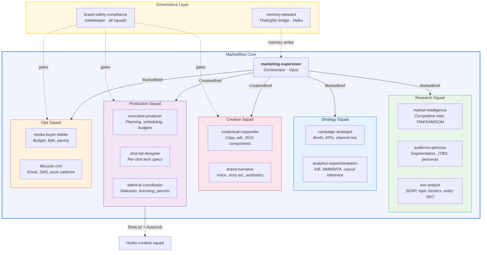
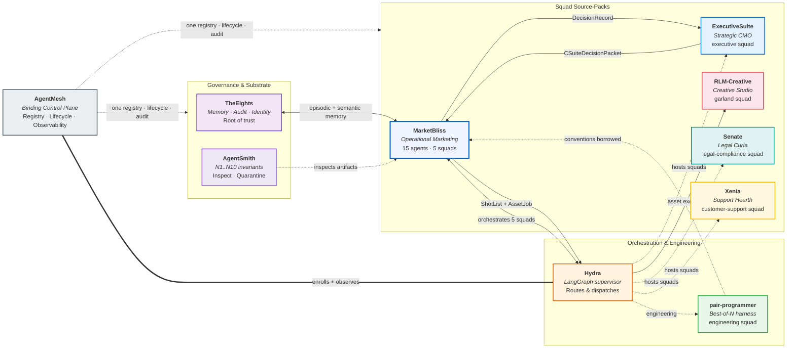
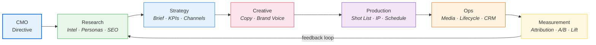

<p align="center">
  
</p>

<h1 align="center">MarketBliss</h1>

<p align="center">
  <strong>Enterprise Multi-Agent Marketing Platform</strong><br/>
  Turn strategic CMO directives into executed marketing work — research, strategy, briefs, copy, production, media plans, lifecycle programs, and measurement — all orchestrated by AI agents.
</p>

<p align="center">
  
  
  
  
  
  
</p>

---

## What is MarketBliss?

MarketBliss is the **operational marketing organization** for the [Hydra](https://github.com/lebobo88/Hydra) ecosystem. It provides a team of 15 specialist AI agents — organized into 5 coordinated squads — that collaborate to execute the full marketing lifecycle: from competitive research and audience segmentation, through campaign strategy and creative production, to media buying, lifecycle automation, and attribution measurement.

**How it works standalone:** A user issues a directive (e.g., *"Build a Q3 demand-gen campaign for our B2B SaaS product"*), and the `marketing-supervisor` orchestrator routes it through the appropriate squads. Research agents analyze the competitive landscape and audience. Strategy agents build the campaign brief with KPIs. Creative agents write copy and define brand narrative. Production agents plan shoots, clear talent/IP, and hand off asset specs. Ops agents allocate media budgets and design measurement plans. Every step is governed by compliance gates and audit trails.

**How it works in the ecosystem:** MarketBliss sits beneath [ExecutiveSuite](https://github.com/lebobo88/ExecutiveSuite)'s strategic CMO, receiving high-level `CSuiteDecisionPacket` envelopes and returning `DecisionRecord` results. [Hydra](https://github.com/lebobo88/Hydra) orchestrates MarketBliss's 5 squad packs alongside other domain squads. [TheEights](https://github.com/lebobo88/TheEights) provides persistent episodic memory and prompt/persona evolution. When creative assets need to be generated (images, video, cinematography), MarketBliss emits `ShotList` + `AssetJob` envelopes that [Hydra](https://github.com/lebobo88/Hydra) routes to [RLM-Creative](https://github.com/lebobo88/RLM-Creative)'s creative production pipeline. MarketBliss owns production *planning* — not asset *generation*.

---

## Architecture Overview

The `marketing-supervisor` orchestrator sits at the center, routing work to 5 specialized squads. Two governance agents (`brand-safety-compliance` and `memory-steward`) operate across all squads.



---

## Ecosystem Integration

MarketBliss is one node in a mesh of **nine sibling AI systems** bound together by a tenth binding layer, **AgentMesh**. Each system has a distinct responsibility, and they communicate via typed envelopes and `MemoryRef` handles. MarketBliss is the operational marketing wing — the source pack behind Hydra's five `marketing-*` squads.

The siblings, by tier:

**Governance & substrate**
- [TheEights](https://github.com/lebobo88/TheEights) — shared memory / audit / identity / governance / self-evolution substrate; the root of trust. MarketBliss writes campaign decisions, briefs, and KPI outcomes into episodic memory here and evolves prompts/personas through its propose → evaluate → commit → rollback flow.
- [AgentSmith](https://github.com/lebobo88/AgentSmith) — artifact inspection, the N1..N10 fail-closed invariants, quarantine + sentinel (the Matrix warden). Validates MarketBliss artifacts (agents, skills, squad packs) structurally before they enter the mesh.

**Orchestration & engineering**
- [Hydra](https://github.com/lebobo88/Hydra) — LangGraph multi-squad supervisor; routes, governs, synthesizes. Hosts MarketBliss's five `marketing-*` squads and routes `ShotList`/`AssetJob` envelopes onward to RLM-Creative.
- [pair-programmer](https://github.com/lebobo88/pair-programmer) — best-of-N engineering harness; Hydra's "engineering" squad. Source of MarketBliss's agent / skill / team / hooks conventions.

**Squad source-packs (each is a Hydra squad)**
- [ExecutiveSuite](https://github.com/lebobo88/ExecutiveSuite) — C-suite executive decision support; the "executive" squad. Its strategic CMO issues `CSuiteDecisionPacket` directives to MarketBliss and receives `DecisionRecord` results.
- [RLM-Creative](https://github.com/lebobo88/RLM-Creative) — creative / media studio; the "garland" squad. Generates assets from the `ShotList`/`AssetJob` envelopes MarketBliss emits (MarketBliss owns production *planning*, not asset *generation*).
- **MarketBliss** (this repo) — enterprise marketing platform; the five "marketing-*" squads (research, strategy, creative, production, ops).
- [Senate](https://github.com/lebobo88/Senate) — PhD-level legal wing, "the Curia": 12 jurists (9 primary + 3 consilium) under the Twelve Tables, resolving conflict by the Law of Citations (majority prevails; Papinian breaks ties; dissents preserved) gatekept by the Tribune's Veto (HITL); the "legal-compliance" squad.
- [Xenia](https://github.com/lebobo88/Xenia-Support) — customer-support "Hearth": an 11-agent support crew for ticket triage, recommendation, VoC, and approval-gated execution with WS-AUTH capability enforcement; the "customer-support" squad.

**Binding layer (the tenth)**
- [AgentMesh](https://github.com/lebobo88/AgentMesh) — the thin, governed control plane that unifies the nine systems behind one registry, one lifecycle supervisor, one observability plane, one federated audit timeline, one external protocol edge, and one operator console. See the [Binding Control Plane](#agentmesh--the-binding-control-plane) section below.



### AgentMesh — the binding control plane

[AgentMesh](https://github.com/lebobo88/AgentMesh) is the tenth layer: the thin, governed **control plane** that binds the nine sibling systems together. It unifies them behind:

- **ONE registry** — SQLite at `~/.agentmesh/state.db`; AgentMesh is the sole writer of `~/.hydra/backends.json`.
- **ONE lifecycle supervisor** — Win32 Job Objects + crash-loop breaker + health probes.
- **ONE observability plane** — OTEL traces + structured logs.
- **ONE federated, read-only audit timeline** — stitched from the TheEights / AgentSmith / Hydra chains.
- **ONE external protocol edge** — A2A v0.3/v1.0, REST, MCP-over-HTTP.
- **ONE operator web console.**

Systems **enroll** by installing a root `mesh-manifest.yaml` validated against AgentMesh's `mesh-manifest.schema.json` — **fail-closed**: JSON-Schema validation **+** constitution attestation (via TheEights) **+** AgentSmith structural inspection must all pass. MarketBliss carries such a manifest at its repository root (`mesh-manifest.yaml`, `kind: SiblingManifest`, `id: marketbliss`), declaring its intended `marketbliss` backends key and `mb.ping` health probe.

Crucially, **AgentMesh enforces no governance of its own.** Authority stays with the precedence chain **TheEights → AgentSmith → Hydra**. AgentMesh routes and observes; it does not arbitrate.

---

## Campaign Lifecycle

A typical campaign flows through all 5 squads in sequence, with feedback loops from measurement back to research.



---

## Agent Roster

### Research Squad

| Agent | Authority | Model | Purpose |
|-------|-----------|-------|---------|
| `market-intelligence` | advisory | Sonnet | Competitive intel, TAM/SAM/SOM, market sizing, trend analysis |
| `audience-persona` | advisory | Sonnet | Quantitative segmentation, JTBD, persona archetypes, intent mapping |
| `seo-analyst` | execute | Sonnet | Pillar/cluster maps, SERP analysis, content-gap mapping, entity SEO |

### Strategy Squad

| Agent | Authority | Model | Purpose |
|-------|-----------|-------|---------|
| `campaign-strategist` | gatekeeper | Opus | Integrated campaign briefs, hypotheses, KPIs, channel-mix decisions |
| `analytics-experimentation` | execute | Sonnet | A/B/MAB design, MMM/MTA interpretation, causal inference, lift tests |

### Creative Squad

| Agent | Authority | Model | Purpose |
|-------|-----------|-------|---------|
| `contextual-copywriter` | execute | Sonnet | Long/short-form copy, multi-variant ads, narrative structures, DCO |
| `brand-narrative` | advisory | Sonnet | Brand voice, story arc, aesthetic-archetype selection |

### Production Squad

| Agent | Authority | Model | Purpose |
|-------|-----------|-------|---------|
| `executive-producer` | execute | Sonnet | Production planning, scheduling, budgeting, crew/vendor sourcing |
| `shot-list-designer` | execute | Sonnet | Translates CreativeBrief into per-shot camera/lens/lighting specs |
| `talent-ip-coordinator` | gatekeeper | Sonnet | Talent releases, music/stock licensing, location permits, chain-of-title |

### Ops Squad

| Agent | Authority | Model | Purpose |
|-------|-----------|-------|---------|
| `media-buyer-bidder` | execute | Sonnet | Budget allocation, bid optimization, channel mix, pacing |
| `lifecycle-crm` | execute | Sonnet | Onboarding/retention/winback, email-SMS-push cadence |

### Governance (cross-squad)

| Agent | Authority | Model | Purpose |
|-------|-----------|-------|---------|
| `marketing-supervisor` | gatekeeper | Opus | Orchestrator — routes work across all 5 squads, synthesizes recommendations |
| `brand-safety-compliance` | gatekeeper | Sonnet | Brand-consistency + regulated-claims gate; HITL escalation |
| `memory-steward` | advisory | Haiku | Episodic memory writes, evolution proposals, context packaging |

> **Role boundaries:** `gatekeeper` agents can block gates and require explicit approval to override. `advisory` agents inform but never block. `execute` agents can call write-tier tools within their privilege scope.

---

## Skills

15 reusable skill bundles, each in `plugins/marketbliss/skills/<name>/SKILL.md`:

| Skill | Purpose |
|-------|---------|
| `marketing-expertise` | Brand positioning, E-E-A-T, 7Ps, pricing, funnel stages, luxury principles |
| `marketing-business-context` | Identity, services, segments, competitive positioning — parameterized per industry profile |
| `aesthetic-archetypes` | 5 visual archetypes: Ethereal Glass, Editorial Luxury, Soft Structuralism, Minimalist Editorial, Industrial Brutalist |
| `marketing-attribution` | MMM, MTA, incrementality, lift tests, method-selection decision tree |
| `audience-segmentation` | RFM, behavioral cohorts, JTBD, ICP, CDP/CRM integration patterns |
| `semantic-seo` | Pillar/cluster topic maps, SERP analysis, entity SEO, content-gap mapping |
| `brand-safety` | Toxicity/bias gates, FDA/FTC/FCA/GDPR rules, prohibited-content registry |
| `campaign-playbook` | 6 industry-specific funnel playbooks with KPI targets and channel mix |
| `creative-brief-protocol` | Canonical `CreativeBrief` schema — 1:1 alignment with Hydra envelope |
| `media-mix-modeling` | Budget allocation, saturation curves, bid strategy, channel-mix solver, pacing |
| `lifecycle-marketing` | Onboarding, retention, winback cadences, behavioral triggers, suppression rules |
| `experimentation-design` | A/B test design, MDE/power, MAB, sequential testing, causal inference (DiD, synth-control, RDD) |
| `marketing-governance` | HITL gate catalog, audit-log shape, `DecisionRecord` schema, three-lines-of-defense |
| `production-planning` | Shoot-day checklists, equipment manifests, timeline/budget templates, crew sourcing |
| `talent-ip-clearance` | Talent releases, music/stock licensing tiers, FTC/ASA/ASCI disclosure, GDPR/COPPA likeness rules |

---

## Commands

9 slash commands available from a Claude Code session in this project:

| Command | Description |
|---------|-------------|
| `/campaign-brief` | Produce a `CreativeBrief` envelope via `marketing-supervisor` + `campaign-strategist` |
| `/market-research` | Run the research squad triad (intel + persona + SEO) |
| `/media-plan` | Generate a media plan with budget allocation, bid strategy, and channel mix |
| `/brand-audit` | Run brand-safety + brand-narrative audit over assets or a campaign |
| `/marketing-retro` | Post-campaign retrospective — each agent contributes a section |
| `/launch-playbook` | Full launch lifecycle: research → strategy → creative → ops |
| `/campaign-landing` | Generate a campaign microsite spec using aesthetic archetypes |
| `/marketing-board` | Convene a marketing board meeting with multi-agent synthesis |
| `/production-brief` | Convert a `CreativeBrief` into production-ready `ShotList` + Schedule + Clearance package |

---

## Industry Profiles

MarketBliss adapts its KPI targets, channel mix, gate thresholds, HITL requirements, and funnel templates per industry. Profiles live in `profiles/`:

| Profile | Slug | Key Characteristics |
|---------|------|---------------------|
| B2B SaaS | `b2b-saas` | Long sales cycles, ABM, product-led growth, SQL/MQL focus |
| DTC E-commerce | `dtc-ecommerce` | ROAS-driven, lifecycle-heavy, seasonal, AOV optimization |
| Professional Services | `professional-services` | Thought leadership, referral networks, long consideration |
| Regulated (Health/Finance) | `regulated-health-finance` | HITL-mandatory gates, FDA/FTC/FINRA compliance, restricted claims |
| Creative-Production | `creative-production` | Portfolio-driven, aesthetic-first, talent management |
| Advertising/Commercial | `advertising-commercial` | Campaign-centric, multi-channel, rapid iteration, bidding-heavy |

---

## Governance & Gates

Every squad declares gates in its `squad.yaml`. Five v1 gate IDs enforce quality and compliance:

| Gate | Applied by | HITL Required |
|------|-----------|---------------|
| `brand-consistency` | `brand-safety-compliance` | When profile = regulated |
| `regulated-claims-review` | `brand-safety-compliance` | Any external publish in regulated industries |
| `budget-cap` | `media-buyer-bidder` | When spend exceeds cap by ≥ 5% |
| `attribution-soundness` | `analytics-experimentation` | When MDE/power undeclared |
| `ip-clearance` | `talent-ip-coordinator` | Unreleased talent or unlicensed music |

Escalations use the `HITLRequest` envelope with subtypes: `campaign_signoff`, `budget_approval`, `regulated_claim_review`, `ip_release_review`, `high_risk_external_publish`.

---

## Getting Started

### Prerequisites

- [Claude Code](https://claude.ai/code) CLI or IDE extension
- Access to the [Hydra](https://github.com/lebobo88/Hydra) ecosystem projects

### 1. Register with TheEights

```bash
# From a Claude Code session inside this directory
mcp__eights__eights_identity_register_project \
  project_id=marketbliss \
  domain=marketing \
  scopes='["public","team:marketing","sensitive:no"]'
```

### 2. Apply the Hydra Router Patch

Follow the instructions in [`integrations/hydra-router-patch.md`](integrations/hydra-router-patch.md) to add 5 `marketing-*` keyword fingerprints to Hydra's router.

Then verify discovery:

```bash
hydra squads | grep marketing-
# Expect 5 lines — one per marketing-* squad
```

### 3. Run a Campaign Brief

```bash
# Via Hydra (from anywhere)
hydra run "Q3 demand-gen plan for a B2B SaaS observability product" \
  --squad marketing-strategy

# Via Claude Code (inside this project)
/campaign-brief Q3 demand-gen plan for a B2B SaaS observability product \
  --industry b2b-saas
```

Output lands in `output/campaigns/<id>/brief.md` with a corresponding `DecisionRecord` in the audit trail.

### 4. ExecutiveSuite Handoff

From an [ExecutiveSuite](https://github.com/lebobo88/ExecutiveSuite) session, ask the CMO to dispatch a `CSuiteDecisionPacket` to MarketBliss. The `marketing-supervisor` processes the directive and emits a `DecisionRecord` back via [Hydra](https://github.com/lebobo88/Hydra).

---

## Directory Layout

```
.claude/
  agents/        15 specialist persona markdown files
  skills/        15 reusable skill bundles (SKILL.md per dir)
  commands/       9 slash-command entry points
  teams/          5 pair-programmer-style team YAMLs
squads/           5 Hydra squad packs (one squad.yaml per dir)
profiles/         6 industry profile YAMLs
integrations/
  eights-bridge/          TheEights adapter stub (v1 — MCP direct)
  hydra-router-patch.md   Router keyword fingerprint instructions
output/           All generated artifacts
  executive/marketing|creative|board/
  research/
  campaigns/<campaign-id>/{brief,strategy,assets,measurement}/
progress/         Run state, checkpoints, audit stream (events.jsonl)
plugins/marketbliss/hooks/hooks.json  Claude Code plugin hooks
PROJECT_MASTER.md Section-9 master plan, 16-section taxonomy coverage
AGENTS.md         Cross-tool behavioral contract (read this first)
CLAUDE.md         Claude-specific @AGENTS.md import shim
```

---

## Connected Projects

| Project | Role | Link |
|---------|------|------|
| **TheEights** | Memory + evolution substrate — episodic, semantic, prompt drift; the root of trust | [github.com/lebobo88/TheEights](https://github.com/lebobo88/TheEights) |
| **AgentSmith** | Artifact inspection — N1..N10 fail-closed invariants, quarantine + sentinel | [github.com/lebobo88/AgentSmith](https://github.com/lebobo88/AgentSmith) |
| **Hydra** | Orchestrator — discovers and routes to MarketBliss's 5 squad packs | [github.com/lebobo88/Hydra](https://github.com/lebobo88/Hydra) |
| **pair-programmer** | Engineering harness — source of agent/skill/team conventions; Hydra's "engineering" squad | [github.com/lebobo88/pair-programmer](https://github.com/lebobo88/pair-programmer) |
| **ExecutiveSuite** | Strategic CMO upstream — issues `CSuiteDecisionPacket` directives; the "executive" squad | [github.com/lebobo88/ExecutiveSuite](https://github.com/lebobo88/ExecutiveSuite) |
| **RLM-Creative** | Creative production — generates assets from `ShotList`/`AssetJob` envelopes; the "garland" squad | [github.com/lebobo88/RLM-Creative](https://github.com/lebobo88/RLM-Creative) |
| **Senate** | Legal Curia — 12 jurists under the Twelve Tables; the "legal-compliance" squad | [github.com/lebobo88/Senate](https://github.com/lebobo88/Senate) |
| **Xenia** | Support Hearth — 11-agent customer-support crew; the "customer-support" squad | [github.com/lebobo88/Xenia-Support](https://github.com/lebobo88/Xenia-Support) |
| **AgentMesh** | Binding control plane — one registry, lifecycle, observability, audit, protocol edge, console | [github.com/lebobo88/AgentMesh](https://github.com/lebobo88/AgentMesh) |

---

## Roadmap

| Phase | Timeline | Milestone |
|-------|----------|-----------|
| Foundation | Week 1 | Scaffold complete (agents, skills, commands, squads, profiles) |
| Research | Week 2 | First end-to-end `MarketBrief` from research squad |
| Creative | Weeks 3–4 | HITL-gated creative squad operational |
| Ops | Weeks 5–6 | Semi-autonomous ops squad (budget + bid plans) |
| Integrations | Weeks 7–8 | First 1–2 external integrations (read-only) behind HITL |

Full plan in [`PROJECT_MASTER.md`](PROJECT_MASTER.md) §11.

---

## License & Ownership

Internal [Hydra](https://github.com/lebobo88/Hydra) ecosystem project.

Owner: rob.hasselbach@gmail.com
